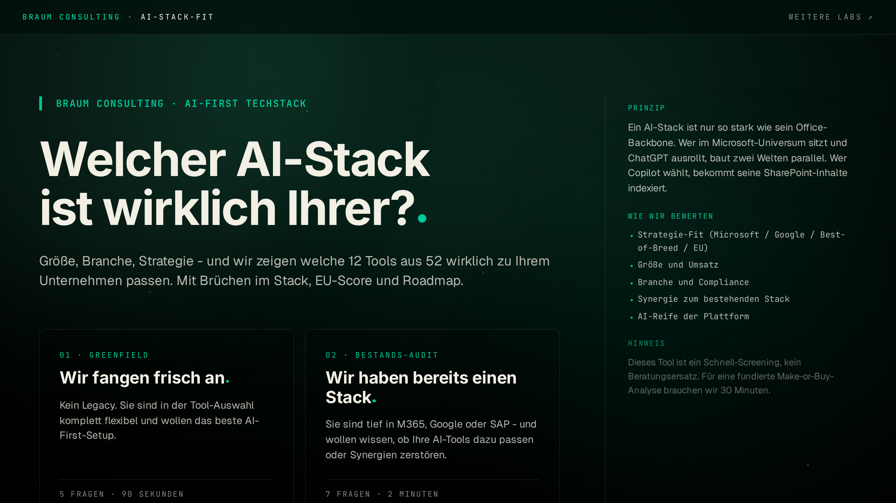

# AI-Stack-Fit

> Which AI-stack is really yours?

A browser-side screening tool for DACH-region companies that figures out, in 90 seconds, which 12 of 52 catalogued AI and business systems actually fit a given setup — including an EU-sovereignty score, friction check, trade-off profile and PDF export.

Live: [braum.org](https://braum.org)



## What it does

- **Wizard** in 4-5 steps (mode, size, industry, revenue, existing stack, strategy) collects the profile entirely client-side.
- **Scoring** ranks 52 systems across 12 categories (Office, AI, Comm, Knowledge, CRM, ERP, Data, Automation, Dev, Marketing, Support, Cloud) and picks one top match plus three alternatives per category.
- **Insights** include five KPIs (synergy, AI readiness, dominant family, EU sovereignty, license cost), a trade-off bar profile, industry-specific peer notes and automatic friction detection in the resulting stack.
- **Worth Watching** highlights one underdog or rising star per category (e.g. Aleph Alpha, Mattermost, Klaviyo, Cursor) as inspiration beyond the mainstream picks.
- **Dice button** generates a random valid profile straight from the landing — useful for demo walks.
- **PDF export** is built locally in the browser via jsPDF (forest-gradient background, around 80 KB, A4) behind a light lead-gate (name, company, email, consent). Lead data is sent only as a custom event to Umami — no mailing list, no backend.

## Stack

| | |
| --- | --- |
| Framework | Astro 5 SSR (`@astrojs/node`, standalone) |
| UI | React 18 (one island with `client:load`) |
| Styles | Tailwind 4 + CSS variables, Forest/Mint/Cream tokens |
| Animations | GSAP (inside the tool island bundle), CSS keyframes for polish |
| PDF | jsPDF (lazy-imported on click) |
| Analytics | Self-hosted Umami, custom events |
| Lint/Format | Biome |
| Runtime | Node 22-alpine, multi-stage Dockerfile, non-root |

## Data pipeline

The tool catalogue is CSV-driven:

```
data/data.csv  ──┐
                 │  pnpm gen:data
                 ▼
src/components/labs/ai-stack-fit/systems.generated.ts
```

`scripts/gen-data.mjs` validates and generates a typed `SYSTEMS` array along with a refresh-date label. Scoring logic, frictions and industry insights live hand-curated in `data.ts`. Refresh workflow is documented in `docs/research-prompts/`.

## Quick start

```bash
pnpm install
cp .env.example .env   # leave defaults for local dev
pnpm dev               # http://localhost:4322
```

## Scripts

| Command | Action |
| --- | --- |
| `pnpm dev` | Astro dev server with HMR |
| `pnpm build` | `astro check && astro build` |
| `pnpm preview` | Serve the built output |
| `pnpm check` | `astro check && tsc --noEmit` |
| `pnpm gen:data` | Rebuild `systems.generated.ts` from `data/data.csv` |
| `pnpm check:data` | Validate the CSV without writing |
| `pnpm lint` | Biome lint |
| `pnpm format` | Biome write-formatter |

## Repository layout

```
.
├── data/data.csv                     # System catalogue (52 tools, single source)
├── docs/research-prompts/            # LLM prompts for quarterly catalogue refresh
├── public/
│   ├── og/default.png                # 1200x630 social card
│   ├── sitemap.xml
│   └── robots.txt
├── scripts/gen-data.mjs              # CSV → generated TypeScript
├── src/
│   ├── components/labs/ai-stack-fit/ # Tool React island + scoped styles
│   ├── layouts/BaseLayout.astro      # Head, OG, JSON-LD, atmosphere
│   ├── lib/
│   │   ├── env.ts                    # SSR / Vite env shim
│   │   ├── pdf.client.ts             # jsPDF builder
│   │   └── track.client.ts           # Umami helper + funnel registry
│   ├── pages/
│   │   ├── index.astro               # Tool lives at /
│   │   ├── 404.astro
│   │   ├── api/health.ts             # Container probe
│   │   └── labs/[...rest].astro      # 301-redirects for legacy /labs/* paths
│   └── styles/global.css             # Tokens, atmosphere layer, eyebrow utility
└── Dockerfile                        # Multi-stage, runs `node ./dist/server/entry.mjs`
```

## Container

```bash
docker build -t ai-stack-fit .
docker run --rm -p 4322:4322 \
  -e PUBLIC_SITE_URL=https://your.domain \
  ai-stack-fit
```

The `HEALTHCHECK` hits `GET /api/health` every 30 s.

## License

MIT — see [LICENSE](./LICENSE).
